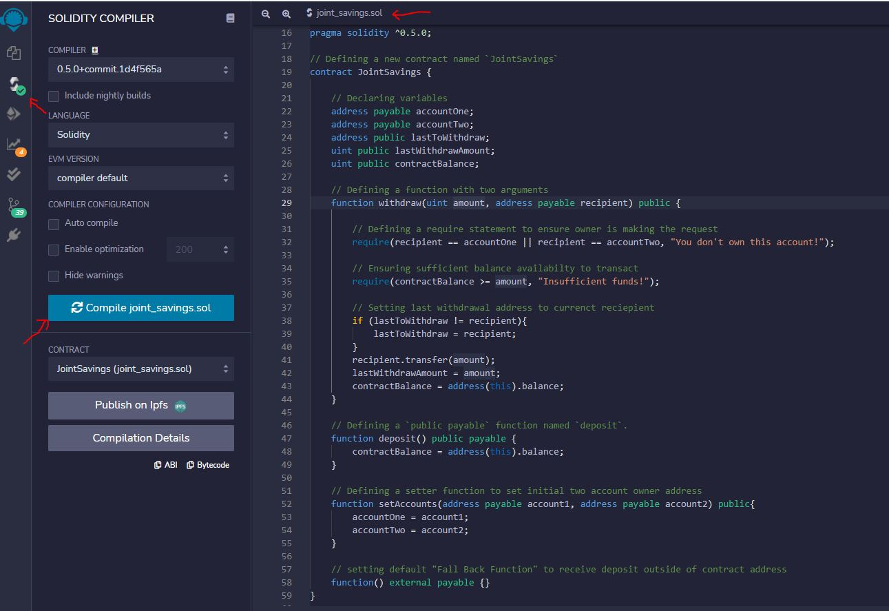

# "Joint Savings Account With Solidity"


### Objective

Automation of opening and maintaining joint accounts for any financial institute using solidity smart contract and Ehtereum Virtual Machine. The smart should be able to accept two user address to control the joint account's activity like deposit, withdrawal and balance check of the funds

### Planning and Execution:

* Complete and compile `JointSavings` smart contract.

* Deploy the smart contract through JavaScript VM environment in Remix IDE

* A folder named `Execution_Results` that contains the images deposit and withdrawal transactions which are designed to test the `JointSavings` functionality in the JavaScript VM

### Step 1 (Successful Compilation):

Using Pragma Compiler version ^0.5.0, created a [smart contract](https://github.com/Ashfaque-Rahman/joint_savings_account_with_solidity/blob/main/Final_Code/joint_savings.sol) that contains several functions like withdraw, deposit, balance check, wrong withdrawal address protection, overdraft protection etc. 




#### Step 2: Compile and Deploy Your Contract in the JavaScript VM

1. Compile your smart contract. If an error occurs, review your code, and make the necessary changes for a successful compilation.

2. In the Remix IDE, navigate to the “Deploy & Run Transactions” pane, and then make sure that “JavaScript VM” is selected as the environment.

3. Click the Deploy button to deploy your smart contract, and then confirm that it successfully deployed.

#### Step 3: Interact with Your Deployed Smart Contract

Now that your contract is deployed, it’s time to test its functionality! After each step, capture a screenshot of the execution, and then save it in a folder named `Execution_Results`. You’ll share this folder with your final submission.

To interact with your deployed smart contract, complete the following steps:

1. Use the `setAccounts` function to define the authorized Ethereum address that will be able to withdraw funds from your contract.

     > **Note** You can either use the following Ethereum addresses or create new, dummy addresses on the [Vanity-ETH](https://vanity-eth.tk/) website, which includes an Ethereum vanity address generator.
    >
    > ```text
    > Dummy account1 address: 0x0c0669Cd5e60a6F4b8ce437E4a4A007093D368Cb
    > Dummy account2 address: 0x7A1f3dFAa0a4a19844B606CD6e91d693083B12c0
    > ```

2. Test the deposit functionality of your smart contract by sending the following amounts of ether. After each transaction, use the `contractBalance` function to verify that the funds were added to your contract:

    * Transaction 1: Send 1 ether as wei.

    * Transaction 2: Send 10 ether as wei.

    * Transaction 3: Send 5 ether.

    > **Note** Remembering how to convert ether to wei and vice versa can be challenging. So, you can use a website like [Ethereum Unit Converter](https://eth-converter.com/) to ease doing the conversion.

3. Once you’ve successfully deposited funds into your contract, test the contract’s withdrawal functionality by withdrawing 5 ether into `accountOne` and 10 ether into `accountTwo`. After each transaction, use the `contractBalance` function to verify that the funds were withdrawn from your contract. Also, use the `lastToWithdraw` and `lastWithdrawAmount` functions to verify that the address and amount were correct.

---

### Submission

* Upload the files for this assignment to your GitHub repository.

* Submit the link to your GitHub repo on Bootcamp Spot.

---

© 2021 Trilogy Education Services, a 2U, Inc. brand. All Rights Reserved.

